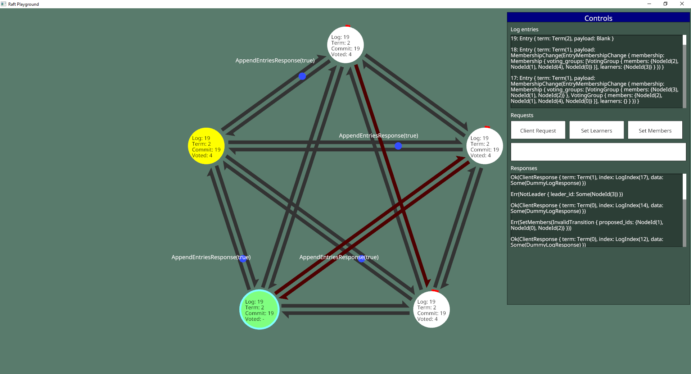

# raft-playground

An application to simulate and test a Raft cluster, using `raft-zero`.

## Instructions

To simulate network disruptions, click on the arrows between nodes. Red means
that messages cannot travel along the connection.

The "Controls" pane can be dragged around by its titlebar. It will show details
of, and allow you to interact with, the currently selected node. The currently
selected node has a cyan outline, and can be changed by clicking on a new node.

The three buttons on the "Controls" pane allow you to send various requests to
the currently selected node. The box below those buttons allows you to set
the arguments for the request. For the "Set Learners" and "Set Members"
requests it expects a comma-separated list of node IDs, eg. `0,1,2`.

The node colours are as follows:

- Yellow: the node believes itself to be the leader.
- White: the node believes itself to be a normal member (candidate or follower).
- Green: the node believes itself to be a learner.
- Grey: the node believes itself to not be part of the cluster.

Note that when a learner is removed from the cluster, it will not receive the
membership change indicating that it has been removed, so it will remain green.
